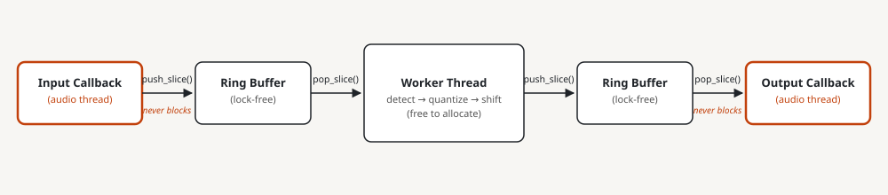
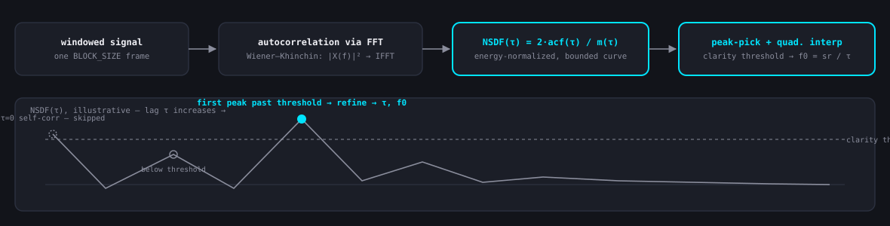
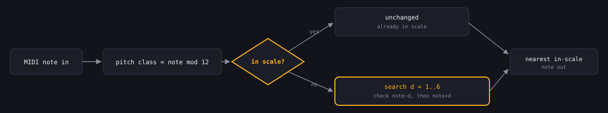
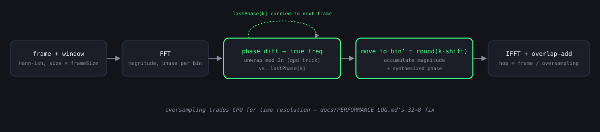
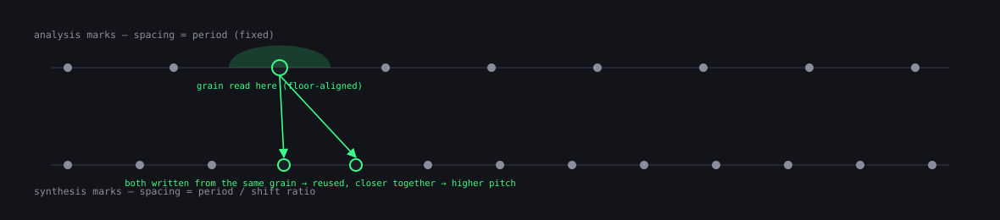
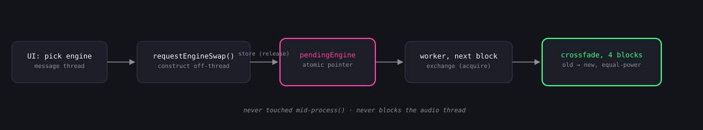

# Algorithm study sheet

Quick-reference for Q&A beyond what fits in the live demo. Two code
tours exist: `.tours/pitchzazz-live-demo.tour` (7 stops, the actual
~10-minute live path) and `.tours/pitchzazz-walkthrough.tour` (12 stops,
the full async/leave-behind version — everything the live path cuts is
still here). Each section below opens with a short plain-language
explanation and a diagram, then the same cheat-sheet depth this doc
always had — not a narrative, for the full story (data, iteration,
reverted attempts) see `docs/ARCHITECTURE.md`, `docs/COMPARISON.md`,
`docs/PERFORMANCE_LOG.md`, and `docs/FINDINGS.md`, all linked inline
below. Seven mechanisms, all seven with a dedicated stop in the full
tour.

## Glossary

Every acronym used below and in the tour, in one place — skim this once
before the demo rather than hunting for a definition mid-sentence.

| Term | Stands for | In one line |
|---|---|---|
| **API** | Application Programming Interface | A defined way for one piece of code to call into another. |
| **CLI** | Command-Line Interface | `pitch-cli`, the original terminal-only Rust prototype, before the GUI plugin existed. |
| **DAW** | Digital Audio Workstation | The host app (Ableton Live, etc.) that loads pitchzazz as a plugin. |
| **DSP** | Digital Signal Processing | The math that actually manipulates the audio signal — detection, shifting, quantizing. |
| **FFI** | Foreign Function Interface | How the C++ plugin calls into the separately-compiled Rust engine. |
| **FFT** / **IFFT** | (Inverse) Fast Fourier Transform | Converts a block of audio between the time domain (a waveform) and the frequency domain (a spectrum), and back. |
| **FIFO** | First In, First Out | The lock-free queue that hands audio between the real-time audio thread and the worker thread. |
| **MIDI** | Musical Instrument Digital Interface | The note-on/note-off message protocol. |
| **MPM** | McLeod Pitch Method | This project's pitch-detection algorithm — a modified, normalized autocorrelation technique. |
| **NSDF** | Normalized Square Difference Function | MPM's core trick: autocorrelation normalized so peaks are comparable at every lag, not just biased toward small ones. |
| **OLA** | Overlap-Add | Reconstructing a signal by summing overlapping windowed segments — the synthesis half of both the phase vocoder and PSOLA. |
| **PSOLA** / **TD-PSOLA** | (Time-Domain) Pitch-Synchronous Overlap-Add | One of this project's three pitch-shift engines — re-spaces time-domain grains to change pitch. |
| **PV** | Phase vocoder (informal shorthand) | Used in a couple of latency tables below for this project's frequency-domain pitch-shift engine. |
| **SPSC** | Single-Producer, Single-Consumer | The threading pattern the lock-free ring buffers rely on: exactly one thread writes, exactly one reads. |
| **STFT** | Short-Time Fourier Transform | Repeated FFTs over overlapping windows — what the phase vocoder is built on. |
| **TSM** | Time-Scale Modification | Changing a signal's duration without changing its pitch — the first stage (WSOLA) of the Varispeed engine. |
| **UB** | Undefined Behavior | C++ behavior the language standard places zero requirements on — a real, crash-capable bug class, not a style nit. |
| **UI** / **UX** | User Interface / User Experience | |
| **ULP** | Unit in the Last Place | The smallest possible gap between two adjacent representable floating-point numbers — the scale of section 5's floor-alignment rounding bug. |
| **WSOLA** | Waveform Similarity Overlap-Add | The correlation-guided time-stretching technique behind the Varispeed engine; also used generically for "OLA that searches for the best-matching splice point." |

Two symbols that show up a lot and aren't acronyms: **τ** (tau) is lag,
measured in samples — "how far offset is this copy of the signal from
itself?" **k** is an FFT bin index — "which frequency slot in the
spectrum?"

---

## 1. Real-time audio safety (no-block / no-allocate / no-lock)

**How it works, simply:** the audio callback that the OS calls on a
hard deadline does exactly one thing — push or pop a lock-free queue.
Everything expensive (detection, quantization, pitch-shifting) happens on
a separate worker thread that has no deadline and is free to allocate,
lock, or block.

**The rule:** nothing in an audio callback (`processBlock`, cpal's
`build_input_stream`/`build_output_stream` closures) may block, allocate,
or take a lock. The callback runs on a real-time thread with a hard
deadline (one buffer's worth of time); miss it once and the OS drops
audio — a glitch, not a slow frame.

**Why each one is fatal:**
- **Block** (mutex, I/O, `std::thread::sleep`) — the callback simply
  doesn't return in time, no matter how briefly it was going to block for.
- **Allocate** (`new`, `Vec::push` past capacity, `malloc`) — the
  allocator itself can take an internal lock or walk a free list; its
  worst-case time is unbounded, not just "usually fast."
- **Lock** (any mutex) — even uncontended, acquiring one is not guaranteed
  wait-free, and if the *other* side of that lock is ever preempted while
  holding it, the audio thread stalls waiting on a thread the OS isn't
  scheduling right now (priority inversion).

**The fix: lock-free SPSC ring buffer.** `juce::AbstractFifo`
(C++) and `ringbuf` (Rust) both give atomic-index-based handoff with no
internal mutex — audited by reading actual source before use, not
trusted from docs (`docs/ARCHITECTURE.md`'s dependency-audit template).
Two FIFOs: input (audio thread → worker) and output (worker → audio
thread). The worker thread has no real-time deadline, so all the
allocating/blocking DSP work (FFTs, buffer resizing) happens there.

**C++ shape** (`cpp-plugin/Source/PluginProcessor.h:16-31` class doc,
`PluginProcessor.cpp:155-244` `processBlock`):
- Downmix to mono into a **fixed-size stack array** `std::array<float,
  256> mono` (`PluginProcessor.cpp:197`) — no heap allocation per block.
- Push into `inputFifo` via `prepareToWrite`/`finishedWrite`
  (`PluginProcessor.cpp:211-217`) — two-region API because the ring
  buffer can wrap mid-write; `size1`/`size2` are the two contiguous
  spans to copy into.
- Pop from `outputFifo` via `prepareToRead`/`finishedRead`
  (`PluginProcessor.cpp:228-234`). **Underrun handling**
  (`PluginProcessor.cpp:220-223, 237-239`): if fewer samples are ready
  than requested, the shortfall is filled with `0.0f` — silence — rather
  than blocking to wait. Silence is the correct real-time-safe failure
  mode; a stall is not.

**Rust shape** (`crates/pitch-cli/src/main.rs:231-289`, comment anchor
"Input callback: copy into the ring buffer"): same pattern — a fixed
`[0.0f32; 256]` stack buffer for downmix/upmix, `push_slice`/`pop_slice`
on `ringbuf`'s producer/consumer halves, silence-fill on underrun
(`main.rs:264-265`). One documented near-miss left in as a comment
(`main.rs:270-273`): an earlier draft used `vec![0.0f32; frames]` inside
the output callback — a heap allocation on every single callback — caught
in review before it shipped.

**Likely questions:**
- *Why not just use a mutex with `try_lock` and skip the block on
  failure?* That silently drops audio (from the producer's perspective,
  data submitted disappears) instead of gracefully degrading to silence
  under backpressure, and still isn't guaranteed lock-free — `try_lock`
  itself can have OS-level cost. The FIFO's overwrite/underrun semantics
  are chosen and documented, not incidental.
- *What guarantees `AbstractFifo`/`ringbuf` are actually lock-free and
  not just named that way?* Both were audited by reading actual source
  (`~/.cargo/registry/src/` for `ringbuf`; JUCE source for
  `AbstractFifo`) for atomic-index-based reads/writes with no internal
  mutex — see `docs/ARCHITECTURE.md`'s "Dependency audit" section for the
  `ringbuf` writeup and `PluginProcessor.h:28-30`'s doc for the
  `AbstractFifo` one.
- *What happens on overflow (producer faster than consumer)?* The input
  side isn't discussed as a failure mode here because the pipeline is
  paced by the audio device's own callback rate on both ends — producer
  and consumer run at the same sample rate, so sustained overflow doesn't
  occur in steady state; only startup/underrun (consumer momentarily
  behind) is a real, expected case.
- *Why fixed-size 256-sample chunking instead of processing the whole
  block at once?* It's just the downmix/upmix stack-buffer size — small
  enough to avoid a large stack allocation, large enough to keep the
  copy-loop overhead low; unrelated to the FIFO or DSP block size (2048).

---

## 2. Pitch detection — McLeod Pitch Method (MPM) / NSDF peak-picking

**How it works, simply:** a periodic signal looks like itself when you
shift it forward by exactly one period, so autocorrelation (comparing the
signal to a delayed copy of itself at every possible delay) finds a peak
at that delay. MPM's (the McLeod Pitch Method's) contribution is normalizing that
comparison — the NSDF, or Normalized Square Difference Function — so
peaks are comparable across delays, then trusting the first
strong peak rather than the tallest one — that's what fixes the classic
"detected the octave below" failure mode plain autocorrelation has.

Ported line-for-line from the Rust `pitch-detection` crate's
`McLeodDetector`, not re-derived from the paper — both engines need
identical peak-picking/interpolation for the Rust-vs-C++ comparison to
mean anything (`cpp-plugin/Source/DSP/PitchDetector.h:16-23`).

**Pipeline** (`PitchDetector::detect`, `PitchDetector.cpp:178-191`):

1. **Energy gate** (`PitchDetector.cpp:182-186`): sum of squares over the
   block; if `energy < powerThreshold` (0.15,
   `PitchDetector.h:61`), return `{0, 0}` immediately — skip the FFT
   entirely for silence/noise-floor input. Cheap early-out, not a
   correctness requirement of MPM itself.
2. **Autocorrelation via FFT** (Wiener–Khinchin theorem) —
   `normalizedSquareDifference`, `PitchDetector.cpp:135-176`:
   zero-pad the signal into a complex buffer, forward FFT, replace each
   bin with `|X(f)|²` (`PitchDetector.cpp:146-147`), inverse FFT, take
   the real part. This computes the full autocorrelation in
   `O(N log N)` instead of `O(N²)` for a direct lag-by-lag sum.
3. **NSDF normalization** — the "modified" part of MPM. Plain
   autocorrelation `acf[τ]` isn't comparable across lags: its magnitude
   depends on how much signal energy remains in the overlapping window at
   that lag, so a naive peak-pick is biased toward small τ. MPM instead
   computes `m(τ) = acf[0]_left + acf[0]_right` (the sum of squared
   energy in the two windows being correlated at lag τ, computed
   incrementally by `mOfTau`, `PitchDetector.cpp:29-42`) and forms
   `nsdf[τ] = 2·acf[τ] / m(τ)`. This ratio is bounded in `[-1, 1]` and
   roughly stationary in expected value across lags, making cross-lag
   peak comparison meaningful — the actual reason MPM outperforms plain
   autocorrelation peak-picking for pitch detection.
4. **Skip τ=0**: `detectPeaks` (`PitchDetector.cpp:50-85`) explicitly
   walks past the initial positive run at the start of the NSDF before
   looking for lobes (`PitchDetector.cpp:56-57`) — self-correlation at
   zero lag is always the global maximum and never a meaningful pitch
   period.
5. **Clarity threshold**: `pitchFromPeaks` (`PitchDetector.cpp:108-119`)
   takes the *first* peak (lowest τ, i.e. highest frequency candidate)
   whose NSDF height exceeds `clarityThreshold` (0.1,
   `PitchDetector.h:62`), not the tallest peak overall — MPM's
   documented preference for the lowest-lag strong peak, since higher-lag
   peaks are often octave-below false positives.
6. **Quadratic interpolation** for sub-sample τ refinement
   (`findQuadraticPeak`, `PitchDetector.cpp:89-99`): fits a parabola
   through `(-1, y0), (0, y1), (1, y2)` around the integer-sample peak and
   solves for the true vertex, giving sub-sample lag precision without
   upsampling the NSDF itself. `frequency = sampleRate / τ`.

**FFT normalization convention** (`PitchDetector.cpp:151-168`): JUCE's
inverse FFT auto-divides by `N`; `rustfft` normalizes neither direction
(caller's responsibility). The C++ port explicitly multiplies the
inverse-FFT result back by `fftSize` (`PitchDetector.cpp:170`) to
reproduce the same *unnormalized* round-trip `rustfft` has — deliberately
reintroducing an "error" rather than "fixing" it, because `m_of_tau`'s
`start` term (`2 * acf[0]`) so heavily dominates the per-sample
subtraction that follows it that the NSDF ratio ends up close to a true
normalized coefficient regardless of the exact inflation factor; what
matters is matching the *shape* Rust's constants (`POWER_THRESHOLD`,
`CLARITY_THRESHOLD`) were tuned against, not an independently "clean"
computation. Missing this entirely (not compensating for JUCE's 1/N at
all) would have made pitch detection silently never cross its clarity
threshold — no crash, just permanently `{0, 0}` (`docs/COMPARISON.md`'s
FFT-normalization section, `docs/FINDINGS.md` #10).

**FFT size divergence**: Rust zero-pads to exactly `blockSize +
blockSize/2` (3072 for a 2048 block, `realfft` accepts any length); C++
must round up to the next power of two (4096, JUCE's `dsp::FFT`
requirement) — `PitchDetector.cpp:11-21`'s `nextPowerOfTwoOrder`. Verified
harmless by the same "extra padding gets swamped by the normalization
term" argument as above, not just assumed (`docs/COMPARISON.md`'s FFT
size constraints section).

**Likely questions:**
- *Why quadratic interpolation here but not, say, a more accurate
  parabolic-fit-in-log-magnitude approach used elsewhere in pitch
  literature?* This is a direct port of the Rust crate's own
  `find_quadratic_peak` — matching the reference implementation exactly
  was the design constraint (`PitchDetector.h:16-23`), not an independent
  choice of interpolation method.
- *What happens right at the FFT size boundary — e.g. exactly a power of
  two already?* `nextPowerOfTwoOrder` uses `while (size < n)`, so an
  exact power of two would pad to the *next* one up, not itself — a
  minor extra doubling that's inside the "harmless, swamped by
  normalization" argument above, not a special case.
- *Why is τ=0's positive run skipped by walking past it, rather than just
  starting the search at τ=1?* Because after τ=0's global max, the NSDF
  can dip negative and re-enter a *second* positive lobe near τ=0-ish
  before the true pitch-period peak — walking past the entire first
  positive-until-negative run (not just index 0) is the correct general
  skip, matching `detectPeaks`' actual loop structure
  (`PitchDetector.cpp:56-57`).
- *Why not just use the tallest NSDF peak instead of the first-above-threshold
  one?* The tallest peak is often at τ=0 itself or an octave-related
  lag; MPM's whole contribution is "trust the first peak that's clearly
  periodic enough" rather than "trust whichever peak is largest," which
  is what actually fixes the octave-error problem plain autocorrelation
  peak-picking has.

---

## 3. Scale quantization — nearest-in-scale search

**How it works, simply:** if the detected note is already one of the
scale's own notes, leave it alone. If it isn't, walk outward by semitone
— one below, one above, two below, two above, and so on — until landing
on a note that's in the scale; on a tie, the note below wins.

`cpp-plugin/Source/DSP/Scale.cpp:55-76`, `nearestInScaleMidi`.

**Algorithm:**
1. `pitchClassOf(midiNote) = ((midiNote % 12) + 12) % 12`
   (`Scale.cpp:39-42`) — the extra `+ 12` before the second `%` handles
   C++'s `%` returning a negative result for negative operands (not
   relevant for valid MIDI notes ≥0, but keeps the helper correct in
   general).
2. If the note's pitch class is already `scale.containsPitchClass(...)`
   (`Scale.cpp:45-53`, a direct membership check against the scale's own
   interval table `intervalsFor(mode)`, relative to the tonic), return it
   unchanged — pass-through, no correction needed.
3. Otherwise, search outward by semitone distance 1 through 6
   (`Scale.cpp:60-69`): at each distance, check **below first, then
   above** (`Scale.cpp:62-67`) — on a tie (equidistant in-scale notes on
   both sides), the lower note wins. The loop allows up to distance 6,
   but never actually needs more than 1 for any of the seven `ScaleMode`
   variants this type supports: all seven are rotations of the same
   major-scale step pattern (W-W-H-W-W-W-H — `Scale.cpp:14-20`), so the
   largest possible gap between two scale members is always exactly a
   whole tone, for every mode, not just major — verified by
   construction, not assumed. 6 is a generic worst-case bound instead
   (half the 12-semitone chromatic octave — the true worst case for
   *any* conceivable pitch-class membership set, including ones this
   codebase doesn't currently support), chosen to keep the search
   decoupled from `intervalsFor()`'s specific interval tables rather
   than hard-coding an assumption that would silently need revisiting
   if a sparser scale type were ever added. Free either way — this runs
   once per audio block.
4. Fallback: return the original note unchanged if no distance 1-6 search
   found anything — unreachable in practice since every `ScaleMode` here
   has 7 pitch classes (`Scale.cpp:71-75`), kept as a defensive
   non-UB fallback rather than an unreachable-panic.

**The historical bug** (`crates/pitch-core/src/scale.rs:1-22` module
doc — this is the single strongest "found and fixed a real, non-obvious
bug" story in the repo, worth having ready): the original prototype
built a lookup table of in-scale MIDI notes by walking `Scale::intervals`
and writing into a `Vec` **pre-sized to `scale.notes().len()`**. That
silently assumed `intervals.len() == notes.len()`, which the
`rust-music-theory` crate does not guarantee for every `ScaleType`/`Mode`
combination — depending on whether the octave-closing interval is
included, the loop either wrote past the vector's end or left trailing
zeroed (bogus) entries. Result: pitch detection and pitch shifting both
worked correctly, but note-snapping was **silently wrong for some
scales** — no crash, no error, just musically wrong output, and only for
certain scale/mode combinations, making it easy to miss in casual
testing. This was the actual reason the original project stalled. The
fix sidesteps the interval bookkeeping entirely: read the scale's own
`notes()` pitch classes directly (the crate's own source of truth)
instead of reconstructing them from intervals — fewer invariants to get
right, trivially testable against every scale type.

**Likely questions:**
- *"What would you have done differently?"* Build the membership test
  from the library's own authoritative accessor (`notes()`) from the
  start, rather than hand-deriving a parallel data structure
  (`intervals` → table) whose size relationship to the source of truth
  was assumed, not verified. The general lesson: when a data structure's
  invariant (`intervals.len() == notes.len()`) isn't documented or
  enforced by the type system, don't build code that silently depends on
  it holding.
- *Why outward search instead of computing the nearest scale degree
  analytically (e.g. via modular arithmetic on the interval table)?* The
  outward linear search is simpler to get right and cheap (max 12
  iterations, small constant work each) — for a 7-note scale against a
  12-note chromatic space this isn't a performance-sensitive path, so
  simplicity wins over a cleverer closed-form.
- *Why does "below" win ties instead of "above," or nearest-regardless-of-direction
  with no tiebreak?* An arbitrary but *documented and tested* choice
  (`scale.rs:44-47`) — the point being that tie-breaking direction is
  exactly the kind of detail that's invisible until someone asks, so it's
  called out explicitly rather than left as an accidental artifact of
  loop order.
- *If every supported mode's worst-case gap is only 1 semitone, why
  does the loop allow up to 6 — why not just compare the nearest note
  above and below directly?* Because 6 isn't derived from what the
  seven `ScaleMode` variants happen to guarantee today (they'd only
  ever need 1) — it's the generic worst case for *any* pitch-class
  membership set on a 12-note chromatic octave (half of 12), chosen so
  the search's correctness doesn't depend on an assumption
  (`intervalsFor()`'s tables never producing a gap bigger than 2) that
  would silently need revisiting if a sparser scale type were ever
  added. The extra reach is genuinely never exercised by any mode
  shipped today, but costs nothing to keep — this runs once per block.
- *Does this ever produce audibly wrong results for chromatic or
  whole-tone-ish scales?* No — `containsPitchClass` handles a
  chromatic (all-12) scale as == every note in scale (`Scale.cpp:57`
  short-circuits to pass-through for every input). More generally: the
  search bound of 6 is correct for every scale the type system can
  express, not merely sufficient for the seven that exist today.

---

## 4. Phase vocoder pitch shifting

**How it works, simply:** take the signal into the frequency domain with
an FFT (Fast Fourier Transform), then move each frequency bin's content to a new bin scaled by the
pitch ratio — a bin at 440Hz moves to 880Hz for a shift up an octave —
and convert back. Relocating spectral content is the entire pitch-shift
mechanism; everything else in this section is bookkeeping to make that
relocation sound clean (phase coherence, windowing) rather than smeared.

Bernsee-style STFT phase vocoder (`smbPitchShift`), ported from the Rust
`pitch_shift` crate. `PitchShifter::shiftPitch`,
`cpp-plugin/Source/DSP/PitchShifter.cpp:69-168`.

**Setup:** `shift = 2^(semitoneShift/12)` (`PitchShifter.cpp:72`) — the
frequency-domain-native way to express a pitch ratio; `overSampling`
sets the STFT hop (`step = frameSize / overSampling`,
`PitchShifter.cpp:76`) — more overlap gives the phase-tracking math more,
closer-spaced samples, generally reducing "phasiness"/transient smearing
(`docs/PERFORMANCE_LOG.md`'s OVER_SAMPLING re-evaluation entry; project
uses 8, matched on both engines).

**Per analysis frame** (once `overlap >= frameSize`,
`PitchShifter.cpp:94-166`):

1. **Window + forward FFT** (`PitchShifter.cpp:98-101`): Hann-ish window
   (`PitchShifter.cpp:52-53`) applied to the FIFO'd input, forward FFT
   (unnormalized, matching `realfft`'s convention).
2. **True instantaneous frequency per bin** (`PitchShifter.cpp:106-127`):
   for each bin `k`, compute the raw phase difference from the last frame:
   `deltaPhase = (phase - lastPhase[k]) - k·expected`, where `expected =
   2π/overSampling` is the phase advance a bin's *nominal* center
   frequency would produce over one hop. The **"qpd" trick**
   (`PitchShifter.cpp:116-122`) unwraps this into the range `(-π, π]`:
   `qpd = (int64_t)(deltaPhase / π)`, then round `qpd` to the nearest
   *even* integer (`qpd += qpd & 1` if positive, `qpd -= qpd & 1` if
   negative — since `qpd & 1` is 1 only when `qpd` is odd, this pushes
   odd values one further away from zero, landing on the nearest even
   value), then `deltaPhase -= π·qpd`. Subtracting an even multiple of π
   is equivalent to `deltaPhase mod 2π` folded into `(-π, π]`, without a
   branch-heavy explicit modulo — this is the true, unwrapped phase
   deviation from what was expected, and `k·pitchWeight +
   oversampWeight·deltaPhase` (`PitchShifter.cpp:125`) turns that into
   the bin's true instantaneous frequency estimate.
3. **Bin relocation**: magnitude and frequency are written to `bin' =
   round(k · shift)` (`PitchShifter.cpp:109`), not bin `k` itself — this
   is the actual pitch-shift step: reading content from bin `k` but
   *placing* it at the shifted bin index remaps the spectrum's frequency
   content by the shift ratio. Multiple source bins can collide into the
   same destination bin (shift > 1) or leave gaps (shift < 1); magnitudes
   accumulate additively into a collided bin
   (`synthesizedMagnitude[index] += magnitude`), frequency is overwritten
   (`synthesizedFrequency[index] = ...`).
4. **Coherent phase accumulation** (`PitchShifter.cpp:131-135`):
   `phaseSum[k] += meanExpected · synthesizedFrequency[k]`, then
   `fftFreq[k] = polar(magnitude, phaseSum[k])`. `phaseSum` persists
   *across* frames (it's a member, not a local) — this is what keeps the
   resynthesized phase locked coherently frame-to-frame instead of each
   frame independently guessing a phase, which is what actually prevents
   phasiness artifacts.
5. **Conjugate-symmetric mirror** (`PitchShifter.cpp:144-145`): only
   bins `[0, halfFrameSize)` were synthesized (real-input half-spectrum,
   matching Rust's real-FFT convention); mirrored into the upper half so
   a full complex inverse FFT reconstructs a real time-domain signal.
6. **Inverse FFT + windowed overlap-add**
   (`PitchShifter.cpp:147-165`): inverse FFT, re-apply the window, scale
   by `accOversamp` (a normalization constant compensating for JUCE's
   auto-1/N inverse vs. `realfft`'s un-normalized convention — same
   pattern as the pitch detector, `PitchShifter.cpp:149-155`), accumulate
   into `outputAccumulator`, then shift the FIFOs by `step` samples
   (hop = `frameSize / overSampling`) — the actual overlap-add.

**Frame size / FFT convention divergence, and why it's tunable at all**
(`PitchShifter.cpp:27-42`, `docs/COMPARISON.md`'s FFT size constraints
section): both engines derive their analysis frame from the same target,
`sampleRate · windowMs / 1000`, but round it completely differently.
Rust's `pitch_shift` crate rounds up to the nearest *even* number
(`realfft` accepts any even length) — a near-continuous function of
`windowMs`, moving by 1-2 samples per millisecond of change. C++ must use
a power of two (JUCE's `FFT` requirement) and rounds to the **nearest**,
not the next, power of two — a **step function**: every `windowMs` value
in a wide band around a power of two collapses to the *same* frame size,
so most of that band buys zero latency change, and crossing a boundary
buys a big, discontinuous jump. This asymmetry is why the exact same
`windowSizeMs` constant produces very different real latency on the two
engines, and why tuning it at all only makes sense by first knowing
*where* the nearest C++ power-of-two boundary sits (`nearestPowerOfTwo`
rounds to 1024 for any target below ~1536, to 2048 for any target in
~[1536, 3072), etc.) rather than treating `windowMs` as if it moved
latency smoothly:

| `windowSizeMs` | C++ frame (nearest pow2) | Rust frame (round-to-even) |
|---|---|---|
| 50 (original) | 2048 @ 44.1/48kHz (~46.4/42.7ms), 4096 @ 96kHz (~42.7ms) | 2206/2400/4800 (~50.0ms, all rates) |
| 30 (current, confirmed by ear 2026-08-19) | 1024 @ 44.1/48kHz (~23.2/21.3ms), 2048 @ 96kHz (~21.3ms) | 1324/1440/2880 (~30.0ms, all rates) |

Two consequences worth being explicit about, both surfaced by the same
2026-08-19 tuning pass (`docs/PERFORMANCE_LOG.md`'s dated entry):
1. **The C++/Rust gap widened, not just the absolute numbers.** At 50ms
   the two engines were already measurably different (~46.4ms vs.
   ~50.0ms @ 44.1kHz, a ~7% gap) but close enough to describe informally
   as "about the same." At 30ms they're ~23.2ms vs. ~30.0ms — a ~29% gap
   — because C++'s step function had room to drop a full octave (2048→
   1024) while Rust's near-continuous one just tracked the target down
   linearly. Picking a *different* nominal `windowMs` changes not just
   the latency number but which engine is closer to which.
2. **It flipped the phase-vocoder-vs-TD-PSOLA ordering.** See section 5's
   latency table below — TD-PSOLA's latency doesn't depend on
   `windowSizeMs` at all (it has its own, independent tuning knobs), so
   tightening only one side of that comparison was enough to invert which
   engine is actually lower-latency by default.

**Likely questions:**
- *Why does the algorithmic latency equal the frame size exactly, not the
  frame size plus block size?* Because the worker only calls
  `process()` once `BLOCK_SIZE` (2048) samples have accumulated, but the
  phase vocoder's own analysis window is *already* ≥ `BLOCK_SIZE` at
  every tested rate — whichever lookahead requirement is larger wins, and
  a live system can never produce output faster than its analysis
  window's worth of future samples has arrived regardless of block-size
  accumulation on top. If `BLOCK_SIZE` were ever tuned larger than the
  frame size, this would flip (`docs/PERFORMANCE_LOG.md`'s "Measured
  pipeline latency" entry).
- *What would happen if `phaseSum` were reset to 0 every frame instead of
  accumulated?* Each frame's resynthesis phase would be independently
  arbitrary rather than continuous with the previous frame's — this is
  exactly the "phasiness"/incoherent-reconstruction artifact phase
  vocoders are notorious for; accumulation is the fix, not an optional
  refinement.
- *Why round-and-collide (`bin' = round(k·shift)`) instead of some
  interpolated bin-splitting scheme?* Simplicity and direct fidelity to
  the reference Rust crate this was ported from — matching an audited
  reference implementation was a harder constraint than independently
  optimizing bin-relocation accuracy (`PitchShifter.h:10-15`).
- *Given the phase vocoder is now lower latency by default, why does
  TD-PSOLA still exist?* See section 5's "why not just use PSOLA" answer
  below — the trade-off was never "PSOLA strictly wins," and that's true
  either direction the latency ordering happens to point.

---

## 5. TD-PSOLA pitch shifting

TD-PSOLA stands for Time-Domain Pitch-Synchronous Overlap-Add.

**How it works, simply:** cut the signal into small grains, one centered
on each detected pitch period, then paste those grains back down at new
positions spaced closer together (pitch up) or farther apart (pitch
down) than they were recorded at. Each grain's own content never
changes — only its *spacing* does. That's the whole mechanism: re-timing
where periods land is what the ear hears as a pitch change, since it's
literally squeezing or stretching how many wave cycles happen per second.

`PSOLAPitchShifter::placeGrainAt`, `cpp-plugin/Source/DSP/PSOLAPitchShifter.cpp:69-151`.
The algorithm family real low-latency vocal-effects hardware uses, built
specifically as a latency-focused alternative to the phase vocoder
(`PSOLAPitchShifter.h:50-60`).

**Core mechanism — grain re-spacing, not re-pitching:**
- **Analysis marks** sit on a fixed grid spaced `periodSamples` apart
  (the current detected-pitch period estimate,
  `updatePeriodEstimate`, `PSOLAPitchShifter.cpp:57-67`).
- **Synthesis marks** sit on a *different* grid, spaced
  `synthesisSpacing = periodSamples / shiftRatio` apart
  (`PSOLAPitchShifter.cpp:172-173`) — closer together for a pitch shift
  up (`shiftRatio > 1`), farther apart for a shift down.
- Each synthesis mark, when it fires (`placeGrainAt`,
  `PSOLAPitchShifter.cpp:69-151`), reads a grain of content from the
  **floor-aligned analysis mark at or before its own position**
  (`readMarkPos = floor(synthesisMarkPos / periodSamples + ε) ·
  periodSamples`, `PSOLAPitchShifter.cpp:130`) and writes that content —
  unchanged — at its own (synthesis) position. **Floor, not round or
  nearest**, specifically to keep the lookahead/latency bound tight: a
  read position that's always ≤ the synthesis mark's own position never
  needs content from the future relative to that mark.
- **Pitch-up**: synthesis marks are closer together than the analysis
  grid, so several consecutive synthesis marks land in the same analysis
  bucket and **reuse/repeat** that grain's content at closer spacing.
  **Pitch-down**: synthesis marks are farther apart, so some analysis
  buckets are **skipped** entirely.
- The critical conceptual point (`PSOLAPitchShifter.cpp:82-97`'s
  comment): placing content back at the exact position it was read from
  cannot change pitch at all — only *re-spacing* grains at closer or
  farther intervals than they were recorded at changes the perceived
  pitch. Grain **width** is a completely independent knob from spacing
  that preserves the spectral envelope/formants — spacing carries pitch,
  width carries timbre, and decoupling those is PSOLA's whole reason for
  existing over naive resampling. Concretely (`PSOLAPitchShifter.cpp:80`):
  `halfWidth = periodSamples · grainWidthMultiplier`, where `periodSamples`
  is the *original, unshifted* detected-pitch period — i.e. the multiplier
  is a multiple of *the current pitch's own period*, not a fixed sample
  count or a fraction of the shifted target. Since a grain spans
  `±halfWidth` around its mark, `grainWidthMultiplier = 1.0` means a grain
  covers exactly 2 periods of the detected pitch; `1.25` (the shipped
  default, `docs/PERFORMANCE_LOG.md`'s 2026-08-19 entry) covers 2.5;
  `0.5` (`grainWidthMultiplierMin`) covers exactly 1, the narrowest this
  control allows.

**Latency derivation** (`PSOLAPitchShifter.h:125-144`,
`PSOLAPitchShifter.cpp:16-40`): `latencySamples = 2 ·
maxHalfWidthSamples`, where `maxHalfWidthSamples =
ceil(sampleRate/minHz · grainWidthMultiplierMax)` — a **fixed** worst-case
tap (2 grain half-widths: one to fill a symmetric grain around a mark,
one more before an accumulator slot a mark could still touch has
definitely been fully written), sized once from the lowest detectable
pitch (`minHz = 80Hz`) and the widest the grain-width control can ever be
set to, not adapted to whatever pitch/width is actually active — a DAW's
plugin-delay-compensation needs one constant number, not "it varies."
This is why PSOLA's latency scales with **pitch period**, not a fixed
analysis-window sample count the way the phase vocoder's does: at a
fixed millisecond floor (`minHz`), the sample-count bound scales exactly
with sample rate, so the *millisecond* figure stays constant across
sample rates (33.3ms → 25.0ms after `minHz` tightening, at both 44.1kHz
and 48kHz — `docs/PERFORMANCE_LOG.md`'s TD-PSOLA entries) — the opposite
of the phase vocoder, whose ms figure *varies* by rate because its
window is power-of-two-rounded in samples.

**Measured latency vs. phase vocoder — a moving target, not a fixed
algorithmic fact** (`docs/PERFORMANCE_LOG.md`'s TD-PSOLA and 2026-08-19
entries): this comparison has been re-measured several times as tuning
changed on *both* sides, and the ordering has actually inverted at least
once. Treat the "TD-PSOLA is lower latency" framing this engine originally
shipped under as a snapshot of one specific tuning state, not a
structural property of the algorithm:

| Stage | 44.1kHz | 48kHz | vs. phase vocoder |
|---|---|---|---|
| Original PSOLA (`minHz=60`, k=2) | 33.3ms | 33.3ms | lower (PV was 46.4/42.7ms) |
| PSOLA floor tightened (`minHz=80`, k=2) | 25.0ms | 25.0ms | lower |
| PSOLA + cross-fade fix, shipped (`minHz=80`, k=3) | 37.55ms | 37.5ms | lower (~19%/~12%) |
| PSOLA cross-fade reverted (`minHz=80`, k=2) | 25.0ms | 25.0ms | lower (~46%/~41%) |
| **PV `windowSizeMs` tightened 50→30** (2026-08-19) | PV: 23.2ms | PV: 21.3ms | **PSOLA now higher** — PV overtook PSOLA's unchanged 25.0ms |
| **PSOLA `grainWidthMultiplierMax` tightened 1.5→1.25** (2026-08-19, experimental) | 31.29ms | 31.25ms | still higher than PV, but ~17% lower than the pre-tightening 37.5ms |

Every row above except the last two changed *one engine's* tuning while
the other stayed fixed — which is exactly why the ordering flipped: the
phase vocoder's `windowSizeMs` and PSOLA's `minHz`/
`grainWidthMultiplierMax` are independent knobs in independent files,
nothing in this codebase keeps them in any particular relative order, and
nothing should — see docs/PERFORMANCE_LOG.md for why re-tuning PSOLA's
`minHz` further wasn't done here (see the "Likely questions" below).

**The floor-alignment epsilon bug**
(`PSOLAPitchShifter.cpp:117-129`, `docs/FINDINGS.md` #18): floating-point
error from repeated `+=` accumulation of `synthesisSpacing`
(`PSOLAPitchShifter.cpp:192`) occasionally left `synthesisMarkPos` a few
ULPs *below* an exact integer multiple of `periodSamples` instead of
exactly on it. `std::floor(17.999999997)` returns `17`, not the intended
`18` — silently reading an entire extra period of stale, wrong-grain
content. Manifested only for specific sample-rate/frequency combinations
(whichever happened to round the wrong way), which at first looked like
normal overlap-add onset smoothing. Diagnosed by noticing that
increasing the safety margin (2x → 3x → 4x `maxPeriodSamples`) left the
gap's *size* completely unchanged — the tell that it wasn't a margin
problem at all — then confirmed via direct instrumentation. Fixed with a
`+1e-6` epsilon before the `floor()` call.

**The crackle/beat artifact — accepted limitation, not silently
swept aside** (`PSOLAPitchShifter.h:83-94`, `docs/FINDINGS.md` #19-20):
reading from a single floor-quantized analysis bucket is exact for a
*stationary* test tone (every bucket is mathematically identical), but
real, non-stationary voice has natural cycle-to-cycle jitter, so
consecutive buckets differ slightly — source content jumps discretely
every time the synthesis position crosses a bucket boundary, audible as
crackle plus a low-frequency beat.

*What was tried:* cross-fading between the two nearest analysis buckets
(the standard PSOLA fix for exactly this artifact class), weighted by
proximity — shipped, at the cost of one more period of lookahead
(`latencySamples` k=2 → k=3). *Why it was reverted:* real listening on
live vocal audio found the artifact **still present, possibly worse**.
Best available (not measurement-confirmed) diagnosis: comb filtering —
blending two waveform segments exactly one period apart is only a clean
blend if the signal is truly periodic at that exact spacing, and real
voice isn't (the fixed `periodSamples` estimate drifts out of sync with
the true, jittering vocal-fold period over a block); blending two
similar-but-phase-shifted copies produces frequency-dependent
cancellation that sweeps as the misalignment changes — plausibly
explaining both why it didn't help and why it may have hurt. Reverted to
single-bucket rather than continuing to tune blind. A real fix needs
**correlation-based alignment** of the two candidate grains before
blending, not blending alone — bigger scope than this project's timeline
has room for; disclosed as a known, accepted limitation, not hidden.
Three separate automated test approaches were tried to *verify* the
crossfade fix and none discriminated fixed-vs-broken (`docs/FINDINGS.md`
#16's account) — the same "automated metric passing ≠ perceptual quality"
lesson the hot-swap crossfade work already logged (finding #14, section
6 below).

**Likely questions:**
- *"Why didn't you just fix the crackle properly instead of shipping a
  known artifact?"* The proper fix (correlation-based grain alignment)
  is a materially bigger scope item than this project's timeline allowed
  for, and the engine's demonstrated value — the latency comparison
  against the phase vocoder — doesn't depend on production-grade
  reconstruction quality. Shipping a documented, understood limitation
  is a defensible engineering call distinct from an undiagnosed bug.
- *Why not just always use PSOLA — or, now, always use the phase
  vocoder?* Neither is a strict upgrade, independent of which one
  currently measures lower latency. PSOLA is pitch-*synchronous* by
  construction — it needs a period estimate to place marks at all, so
  quality degrades on non-stationary/noisy/unvoiced content in a way the
  phase vocoder (which only needs a shift ratio, agnostic to actual
  pitch) doesn't; the crackle artifact above is a direct, real,
  currently-unresolved cost of that dependency. Lower latency and
  equivalent quality aren't both true at once for PSOLA — that's the
  actual trade-off being demonstrated, and it holds regardless of which
  way the latency numbers happen to point on a given day of tuning.
- *Why is grain width locked to the *unshifted* period rather than the
  shifted target period?* That's the entire formant-preservation
  mechanism — see the "core mechanism" bullet above. Widening/narrowing
  it via the creative control deliberately trades away formant
  preservation for a different, granular-synth-like texture
  (`PSOLAPitchShifter.h:9-19`).
- *Why is the grain-width-multiplier upper bound 1.25x (was 1.5x, was
  3.0x) — why not tighten `minHz` instead, or push the multiplier lower
  still?* Two different kinds of knob, deliberately treated differently.
  `grainWidthMultiplierMax` only trades away *creative-control range*
  (how far a user can widen the grain above its 1.0x default) — a UX
  decision with no correctness cost, so it was the first lever pulled
  when the phase vocoder's `windowSizeMs` cut overtook PSOLA's latency.
  `minHz` (80Hz) is different: it's a correctness floor documented as
  sitting "right at the bottom of a typical bass vocal's fundamental," so
  raising it further to chase latency risks breaking pitch tracking on
  real low notes the tool needs to handle — not touched without a
  dedicated listening pass on actual bass content, which hasn't happened
  yet. 1.25x itself is still experimental pending a listening
  confirmation, same caveat 1.5x originally had; a first pass at 3.0x
  pushed worst-case latency to ~75ms, caught by
  `tests/DSP/PSOLAPitchShifterTests.cpp`'s formula assertion.

---

## 6. Hot-swap engine architecture

**How it works, simply:** switching pitch-shift engines live is one
atomic pointer swap, picked up by the worker thread between audio blocks
— never mid-block, so the real-time thread is never affected. To hide
the fact that the new engine starts with no warmed-up internal state,
the old and new engines both process the same audio for a few blocks
while their outputs are smoothly cross-faded, so there's no click or
dropout at the moment of the swap.

Three engines (Rust via FFI, C++ phase vocoder, C++ TD-PSOLA) are
runtime-swappable without an audio dropout. `CorrectorWorker`,
`cpp-plugin/Source/DSP/CorrectorWorker.cpp`.

**The handoff — one atomic pointer exchange, picked up between blocks:**
`requestEngineSwap` (`CorrectorWorker.cpp:87-93`) does `auto* old =
pendingEngine.exchange(newEngine.release(), memory_order_release)` — a
lock-free single-producer/single-consumer handoff for one owned object,
same shape as the audio FIFOs but for an engine instead of a sample
stream. If a previous swap request hasn't been picked up yet, it's
replaced (and deleted) rather than queued — the worker only ever wants
the *latest* request. The new engine is fully constructed on the
message thread, **before** the handoff (`PluginProcessor`'s `setEngine`
comment, `PluginProcessor.h:89-95`) — never during the swap itself —
because construction is the potentially slow part, and doing it off the
worker's hot path means the worker can never fall behind because of it.
The worker only ever picks up a pending swap **between `process()`
calls**, in `run()`'s loop head (`CorrectorWorker.cpp:156-160`) — never
mid-block — so `processBlock` (the real-time thread) is entirely
unaffected by a swap in progress; the FIFOs it touches don't know or
care that a swap happened on the other side.

**Why the pointer exchange alone isn't enough — the crossfade**
(`docs/FINDINGS.md` #14): an instant switch discards the outgoing
engine's warmed-up internal state (windowing FIFO, phase accumulator,
overlap-add buffer) and starts the new engine cold — measured as a real,
audible-scale discontinuity by a dedicated dropout test
(`tests/DSP/HotSwapDropoutTests.cpp`, per `docs/TESTING.md`):
**0.340 max sample delta vs. a 0.014 natural baseline (~24x)**, before
the fix. No existing test caught this beforehand — each engine was
individually correct in isolation; the bug was purely in the *transition*
between two independently-correct things.

**The fix, iterated against real measurements** (`CorrectorWorker.cpp:145-286`):
- For `crossfadeBlocks = 4` blocks (~185ms at 44.1kHz/2048,
  `CorrectorWorker.h:149-155`) after a swap, **both** the old and new
  engine `process()` the *same* input every block
  (`CorrectorWorker.cpp:220-221`) — the old one to keep its output
  continuous through the handoff, the new one to warm up its own state
  rather than sitting idle until an abrupt cut.
- Outputs are blended with **equal-power** gains (`cos(angle)`/
  `sin(angle)`, not linear `(1-t)`/`t` — `CorrectorWorker.cpp:230-243`),
  ramped continuously across the *whole* crossfade window (not reset to
  0..1 within each block, `CorrectorWorker.cpp:228-229`). Linear
  amplitude blending of two independent sources dips below full power
  mid-transition (`gainOld² + gainNew² < 1` except at the endpoints) —
  audible as a brief loudness dip; equal-power keeps `gainOld² +
  gainNew² == 1` throughout, the standard DSP fix for exactly this.
- Iterated three times against real numbers, not by loosening the test:
  1-block linear blend (0.201, still failing) → 4-block linear blend
  (0.051, passing the automated test, but a listening test still heard a
  quiet click) → 4-block equal-power blend (0.078 — the automated metric
  actually *rose* slightly, still well under threshold — user-confirmed
  "better, but still there"). **The automated metric and perceived
  smoothness are not the same bar** — worth remembering when trusting
  either number alone. Root cause of the small remaining residual: the
  two engines' phase accumulators evolve independently with no shared
  reference point, which amplitude-crossfading doesn't fully address — a
  real limitation of swapping between two differently-implemented
  stateful algorithms, not a bug still to be hunted down.

**The "20-30x illusion" benchmark note**
(`docs/COMPARISON.md`'s Performance section): a first-pass Rust-vs-C++
per-block cost comparison looked like C++ was 20-30x faster than Rust —
that comparison was **wrong**: the Rust numbers were from a debug build,
the C++ numbers from Release. Controlled for build profile, block size
(2048), and identical synthetic input, all six numbers (three sample
rates × two engines) land within 350-462µs of each other — noise-level
differences, each engine winning at a different sample rate, both
comfortably under 2% of the real-time budget. The honest conclusion
isn't "language X is faster," it's that an unmatched build profile is an
easy, large, and easy-to-not-notice source of a misleading benchmark —
a methodology lesson, not a language-performance finding. The likely
source of the small remaining gap is FFT backend choice (JUCE's
Apple-optimized vDSP vs. `rustfft`'s portable implementation), not the
language itself.

**Likely questions:**
- *Why 4 blocks for the crossfade and not some other number?* Empirically
  chosen against the automated dropout metric and a listening test
  together — 1 block measurably reduced but didn't eliminate the
  discontinuity; 4 blocks (~185ms) got the automated metric comfortably
  passing. Not derived analytically; iterated against real measurements
  (`CorrectorWorker.h:149-154`).
- *Could the swap happen mid-`process()` under any circumstance?* No —
  `pendingEngine` is only consumed at the top of `run()`'s loop, before
  `inputFifo.prepareToRead` for that iteration; there's no code path that
  checks it again inside a single `process()` call.
- *Why not eliminate the residual click entirely by transferring internal
  state between engines instead of crossfading?* The two engines'
  internal representations (windowing FIFOs, phase accumulators specific
  to each algorithm) aren't compatible with each other in general —
  crossfading smooths the audible transition without requiring the
  underlying state itself to reconcile, which isn't possible between two
  genuinely different algorithms.
- *What would happen if `requestEngineSwap` were called twice in quick
  succession?* The second call's `exchange` replaces (and deletes) the
  first request if the worker hasn't picked it up yet — the worker only
  ever acts on the latest request, and `crossfadeEngine == nullptr` gates
  starting a *new* crossfade, so a rapid second request during an
  in-progress crossfade just waits rather than overlapping two crossfades
  at once (`CorrectorWorker.cpp:156-160`'s comment).

---

## 7. Varispeed + WSOLA pitch shifting

WSOLA stands for Waveform Similarity Overlap-Add.

**How it works, simply:** first, stretch or compress the signal's
*duration* by the pitch ratio while keeping its pitch unchanged (WSOLA
does this part). Then play that stretched signal back through a resampler at a different
rate, which restores the original duration — and that resampling step is
the actual pitch shift, the same physical effect as speeding up or
slowing down a tape reel. Because it's a genuine rate change, formants
shift right along with the pitch, unlike the other two engines, which
deliberately keep formants fixed.

`VarispeedShifter::shiftPitch`, `cpp-plugin/Source/DSP/VarispeedShifter.cpp:13-87`.
Third algorithm family, deliberately time-domain and deliberately not a
variant of the phase vocoder or TD-PSOLA — this project's explicit
"playground for algorithm families" third entry
(`docs/ROADMAP.md`/plan context). Not a novel technique: this is the
standard textbook recipe for time-domain pitch shifting — time-scale
modify by a ratio, then resample by the same ratio to undo the duration
change (Müller, *Fundamentals of Music Processing*, the TSM-based
pitch-shifting chapter; the open-source **SoundTouch** library is a
concrete real-world implementation of the same WSOLA + resample
composition). The two DSP stages themselves (`VarispeedResampler`,
`WSOLATimeStretcher`) are built from scratch for this project, not
wrapped from an existing library — the *composition pattern* is standard,
the *code* isn't borrowed.

**Two stages, in this specific order:**

1. **`WSOLATimeStretcher`** (`WSOLATimeStretcher.cpp:14-202`) — time-
   stretches the *original* signal by `ratio = 2^(semitoneShift/12)`,
   pitch-preserving, duration-changing. Real WSOLA (Waveform Similarity
   Overlap-Add), not fixed-hop overlap-add: ~25ms Hann windows at 50%
   nominal overlap (`synthesisHopSamples = windowSizeSamples/2`,
   `WSOLATimeStretcher.cpp:20`), with each analysis window's exact read
   position nudged by up to `searchRadiusSamples` (window/16,
   `WSOLATimeStretcher.cpp:21`) to whichever nearby offset best
   normalized-cross-correlates against the tail of the previously placed
   window (`searchBestOffset`, `WSOLATimeStretcher.cpp:55-136`) — this
   search is WSOLA's entire reason to exist over naive fixed-hop OLA, and
   also its main failure mode (see below). Correlation length is capped
   to a fixed 256-sample constant independent of sample rate
   (`WSOLATimeStretcher.h:150`), not the full overlap region — see the
   O(sampleRate²) bug below for why that matters.
2. **`VarispeedResampler`** (`VarispeedResampler.cpp:23-80`) — reads the
   stretched signal back at `ratio` via cubic Hermite (Catmull-Rom)
   interpolation (`catmullRom`, `VarispeedResampler.cpp:13-20`), which
   both restores the original duration *and* is the actual pitch-shift
   mechanism: playing content back at a different rate shifts the entire
   spectrum uniformly, formants included — the same physical effect as
   nudging a turntable's pitch fader or varispeed-ing a tape reel. This
   formant shift is the deliberate creative differentiator from the other
   two engines (both of which decouple pitch from spectral envelope on
   purpose), not a defect (`VarispeedResampler.h:8-16`).

**Why this order and not the reverse** (`VarispeedShifter.h:34-45`):
resampling first would mean WSOLA operates on an already time-compressed-
or-expanded signal, so its own fixed-*sample* lookahead would translate
into a *ratio-scaled* amount of real-world latency — worse the further
you shift, unbounded in the worst case. Stretching the original signal
first keeps WSOLA's lookahead exactly what `getLatencySamples()` already
documents: fixed, sample-rate-derived, ratio-independent. The tape/vinyl
character survives either ordering (resampling is still the last op
either way) — only the latency story changes, which is why this was worth
deciding deliberately rather than picking arbitrarily.

**Latency accounting** (`VarispeedShifter::getLatencySamples`,
`VarispeedShifter.h:72-75`): sum of both stages' own fixed latencies —
`WSOLATimeStretcher::getLatencySamples() = windowSizeSamples +
searchRadiusSamples` (`WSOLATimeStretcher.h:131`, ≈26.6ms @44.1kHz after
the radius reduction below) plus `VarispeedResampler::getLatencySamples()
= 2` (the cubic kernel's fixed 4-tap width, `VarispeedResampler.h:82`,
negligible). Neither term depends on `semitoneShift` — the entire point
of the ordering decision above. `varispeedMaxAbsSemitoneShift = ±24`
semitones (`VarispeedShifter.h:21`) is a **buffer-margin safety clamp,
not a latency bound** — unlike PSOLA's `minHz`/`maxHz`, which doubles as
both; Varispeed's two stages have no natural pitch-range clamp to borrow
one from, so this exists purely to keep `VarispeedResampler`'s/
`WSOLATimeStretcher`'s fixed-capacity scratch buffers within a sane
worst-case ratio.

**The click-suppression fade** (`VarispeedShifter.cpp:43-86`): unlike
`PitchShifter`/`PSOLAPitchShifter`, whose windowed synthesis already
tapers to near-zero at grain/frame edges for free, this pipeline's raw
resampled output has no such taper — a hard cut from real audio to
zero-fill silence during the pipeline's own warm-up produced an
audible-scale click (caught by `VarispeedShifterTests.cpp`'s dedicated
cold-start discontinuity test, `maxAdjacentDelta < 0.1f` across 10 blocks
from construction). A **reactive** gain ramp alone can't fix it — by the
time enough consecutive real samples exist for the ramp to settle near
1.0, it's *already* at full gain with no warning before the known
silence boundary. The fix is anticipatory: `produced` (how many real
samples this call actually has) is known before the output loop runs, so
the fade toward silence is computed *backward* from that known boundary
(`fadeOutSamples = 128` ≈ 2.9ms, `VarispeedShifter.cpp:64-65`) rather
than reacted to after crossing it.

**The correlation-search degenerate-match bug — found, then found to be
under-fixed, then actually fixed** (`docs/FINDINGS.md` #23, #24 — the
second entry explicitly supersedes the first, read both for the full
arc): on stationary/periodic material, the *objectively best* match
anywhere in the search window is trivially "match the reference at
near-zero lag" — which corresponds to advancing at the fixed
`synthesisHopSamples` rate instead of the intended ratio-scaled hop, i.e.
the search has every incentive to quietly stop stretching. Confirmed by
direct offset-logging instrumentation on a sustained 220Hz tone: read
position drifted by exactly `synthesisHopSamples` every hop until the
search radius was exhausted, forcing an abrupt corrective jump every 9-13
hops (6-9Hz) — audible as a periodic discontinuity, reported by ear as
sounding similar to PSOLA's own crackle/beat artifact.
  - *First fix attempt (finding #23):* a small penalty proportional to
    distance from the nominal (target) offset, plus reducing
    `searchRadiusSamples` from window/4 to window/16. This measurably
    changed the artifact but didn't remove it — the penalty is negligible
    right near offset 0, exactly where the degenerate preference
    originates, so the cycle just got *smaller and faster* (9-13 hops
    down to ~5), which is perceptually worse: a fast small-amplitude
    correction fuses into continuous buzz/roughness rather than discrete
    clicks. User-reported as "sounds like I'm listening through a fan"
    after this fix shipped — a real example of a fix that looked like
    progress on paper (smaller jumps) while making the perceived quality
    worse.
  - *Actual fix (finding #24):* replaced the proportional penalty with a
    **hard minimum-improvement threshold** in `searchBestOffset`
    (`WSOLATimeStretcher.cpp:92-134`) — the nominal position's own
    correlation score becomes the baseline, and any other offset must
    beat it by a fixed margin (`minImprovementToDeviate = 0.02`) to be
    chosen at all. Nominal wins every tie and near-tie outright, rather
    than merely being *cheaper* to deviate from. Verified by extending the
    same instrumentation across ±0.5 to ±12 semitones: chosen offset
    settles to a stable constant per shift amount (never oscillates), zero
    output discontinuities (`delta > 0.15`) over 122,880 samples per case.
  - *Disclosed limitation, same standard as PSOLA's own crackle/beat
    (`docs/FINDINGS.md` #19/#20):* this is confirmed only against a
    stationary test tone, close to the worst case for any correlation
    search. Real voiced material's natural jitter/harmonic content should
    behave at least as well, but isn't separately measured. A more
    complete fix would track phase continuity explicitly rather than
    gate on a single fixed correlation margin — bigger scope, not
    attempted.

**The O(sampleRate²) search-cost bug** (`docs/FINDINGS.md` #22): an
earlier version correlated the *entire* `synthesisHopSamples`-length
overlap region rather than a fixed-length snippet; since both search
radius and correlation length scaled with `windowSizeSamples` (itself
sample-rate-derived), total search cost scaled as O(sampleRate²), not
O(sampleRate) — invisible at 44.1kHz, but measured live at 96kHz pushing
the shift stage to ~26ms against a ~21ms budget (a real, audible buffer
underrun). Fixed by capping correlation length to a fixed
`maxCorrelationLengthSamples = 256` constant (`WSOLATimeStretcher.h:150`),
independent of sample rate — a short reference snippet is sufficient to
find a good splice offset; it doesn't need to cover the entire overlap
region.

**Likely questions:**
- *Is "Varispeed" the right name if it doesn't actually change tempo with
  pitch the way real tape varispeed does?* The name is accurate to the
  *mechanism and sonic character* (the pitch shift genuinely comes from
  variable-rate resampling, the real varispeed technique, and that's
  exactly why formants shift along with it) but not to traditional tape
  behavior, where duration and pitch are tied together — WSOLA
  deliberately cancels that tie so this engine's output stays
  block-accurate like the other two. Named "Varispeed + WSOLA" in the UI
  specifically to credit both halves rather than imply either alone.
- *Why build WSOLA and the resampler from scratch instead of using
  SoundTouch or a similar existing library?* Consistent with this
  project's whole ethos — every DSP mechanism here (phase vocoder,
  TD-PSOLA, now WSOLA) is built and explained from first principles, not
  wrapped, because the demonstration is the *engineering*, not the
  end-user feature.
- *Why does a "fix" that measurably shrinks the artifact (finding #23)
  not count as done?* Because the metric that was improving (jump size,
  jump frequency) wasn't the metric that mattered (perceived smoothness)
  — the same "automated/proxy metric passing ≠ perceptual quality" lesson
  this project already logged for the hot-swap crossfade (finding #14)
  and PSOLA's crossfade revert (finding #20). Real listening caught what
  the instrumented sine-tone jump-count alone would have called a clear
  improvement.
- *Could the same minimum-improvement-threshold idea fix PSOLA's own
  crackle/beat artifact?* Not directly — PSOLA doesn't have a correlation
  search to bias in the first place; `placeGrainAt` deterministically
  snaps to a floor-quantized analysis bucket
  (`PSOLAPitchShifter.cpp:130`). The *principle* (anchor to nominal,
  require a substantial margin to deviate) could motivate adding a
  bounded local search to PSOLA's placement — which is exactly the
  "correlation-based grain alignment" finding #20 already flagged as the
  not-yet-attempted real fix — but that's new scope, not a parameter
  port. Marked as a follow-up, not started.
